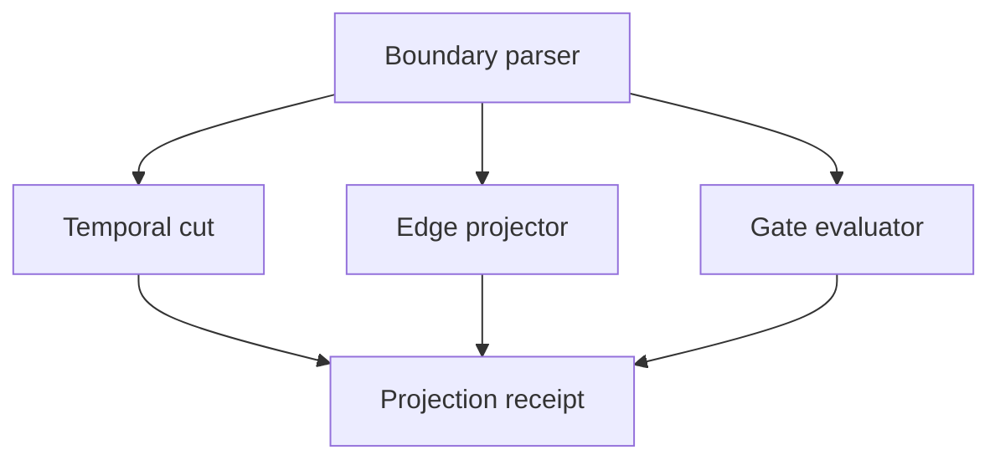

# 3rdi Hatch Design

**Status:** approved hatch design
**Date:** 2026-08-27
**Ground:** owner-supplied pastethoughts, The Daily Slice witnesses, ALEX.2, MEMENTO, Free Graph Front Room

## Outcome

`3rdi` is a portable, repo-backed skill and a small deterministic reference kernel for compiling observer-local projections over attributed events and relations.

It is a third eye only in the operational sense: it can move an aperture through time, location, audience, and decoder context without moving the underlying occurrences. It does not claim omniscience, canonical truth, metaphysics, or production-runtime completeness.

The constitutional sentence is:

> Occurrence is anchored. Availability changes. Attention moves. Relevance can grow. Causation does not rewrite itself.

## Caller experience

The skill accepts a task, source material, or a `3rdi.field/v0` specimen and runs this cycle:

1. `LOCATE` — identify the source cut, observer, aperture, audience layer, location scope, and decoder constitution.
2. `CUT` — freeze occurrence time and the knowledge horizon independently.
3. `DECODE` — preserve carrier, decoder receipt, and realized projection as separate objects.
4. `GATE` — evaluate pure, composable visibility and admission conditions.
5. `PROJECT` — emit only what the selected cut may lawfully expose.
6. `PRESSURE` — run hostile controls against hindsight, retrocausality, and receiver collapse.
7. `RECEIPT` — return a deterministic projection receipt with provenance, fog, and residual uncertainty.

The reference command is:

```bash
python3 skills/3rdi/scripts/compile_projection.py \
  specimens/temporal-coordinate-001.json \
  --cut june-15
```

## Non-collapses

These are break conditions, not style advice:

```text
occurrence time != availability time != attention role != relevance
relevance != causation
carrier != decoder != projection
locus != coordinates != coordinate operation
projection != source != authority
historical cut != current hindsight
actual future != anticipated future
visible != traversable != admitted
gate result != side effect
same surface != same worldline
```

## Temporal coordinates

The kernel owns four independent coordinates:

| Coordinate | Meaning | Stored or derived |
|---|---|---|
| `occurred_at` | When an occurrence is anchored in chronology | Stored on the occurrence |
| `available_from` | When a receipt made it available to an observer and audience layer | Stored on an exposure receipt |
| `focus_at` | Where the temporal aperture is placed | Stored on the cut |
| `known_at` | The latest availability receipt the cut may use | Stored on the cut |

For an occurrence `o`, exposure `x`, and cut `c`:

```text
available(o, c) := x.observer = c.observer
                   and x.layer is admitted by c
                   and x.available_from <= c.known_at

chronological_relation(o, c) := compare(o.occurred_at, c.focus_at)

perceived_role(o, c) :=
  unknown,  when not available(o, c)
  past,     when available and occurred_at < focus_at
  present,  when available and occurred_at = focus_at
  withheld, when occurred_at > focus_at
```

An anticipated future is never synthesized from an actual future occurrence. It is a separate expectation occurrence formed at a lawful earlier cut and aimed at a later target.

`historical` mode requires `known_at <= focus_at`. `reconstruction` mode permits later receipts, labels every post-focus availability as hindsight-bearing, and still forbids later relevance from mutating causal edges.

## Domain model

### Immutable occurrences

`Occurrence` owns identity, chronology, optional stable locus identity, and source references. Content may be opaque. The projection compiler never edits an occurrence.

### Exposure receipts

`Exposure` states who could access which occurrence, from when, through which audience layer, and under which evidence reference. There is no global `known` boolean.

### Expectations

`Expectation` has its own formation time, target time, observer, audience layer, and evidence. It can be visible while its target remains future and unavailable.

### Born edges

An edge is an identity plus an append-only formation history:

```text
EdgeClaim
  id, from, to, relation, class
  first_perceived_at
  discovery_trace[]
  assessments[]

EdgeAssessment
  assessed_at
  status = perceived | admitted | weakened | refused | unresolved
  confidence
  evidence_path[]
  reason
```

The current status is projected from the latest assessment lawful at the cut. It is never stored as a mutable field that erases prior assessments.

`EdgeExposure` separately records when an edge ledger became available to an observer and audience layer. An edge birthday is not global observer knowledge.

`class = causal` and `class = relevance` live in different ledgers. A relevance edge cannot be promoted by changing a label. A new causal claim must be a separately identified edge with its own formation and evidence history.

### Decoder receipts

A carrier is immutable. A decoder receipt declares its constitution and provenance. A projection refers to both. Reinterpretation creates a new descendant receipt and preserves the prior projection.

For location, the stable `locus_id` remains distinct from any coordinate claim. A location decoder must declare source CRS, target CRS, coordinate operation, area of use, and uncertainty or accuracy. The v0 claim identifies the CRS of its supplied coordinates and must match the decoder source CRS. The kernel validates and carries these receipts; it does not claim to perform geodetic transformation.

### Gates

Gates are pure predicates with provenance:

```text
Gate<State> = predicate + source references
GateResult = pass | fail | unresolved + reasons + evidence
```

Composition supports `all`, `any`, and `not`. A gate can decide what enters a projection. It cannot send a message, write a database, grant authority, or otherwise execute a side effect.

### Projection receipt

`3rdi.projection-receipt/v0` contains:

- input and cut digests;
- observer, mode, focus, and knowledge horizon;
- visible occurrences and expectations;
- unavailable categories without leaking hidden content into the observer view;
- projected causal and relevance edges;
- stable causal-ledger digest and independent relevance-ledger digest;
- decoder and location receipts used;
- gate results;
- hindsight flags, source references, and unresolved fog;
- deterministic projection digest;
- an explicit non-authority statement.

## Ownership and module map



- The boundary parser owns schema checks, timestamp normalization, and referential integrity.
- The temporal cut owns availability, chronological relation, perceived role, and hindsight labels.
- The edge projector owns append-only assessment replay and the causal/relevance ledger separation.
- The gate evaluator owns pure predicate composition.
- The receipt assembler owns canonical ordering and digests.
- The skill owns when to invoke the kernel, how to pressure it, and how to explain its limits.
- Persistence, UI, telemetry, network access, and provider adapters are outside the v0 floor.

## Alternatives considered

### A. Pure projection compiler over immutable input — chosen

The caller supplies a field and a cut; the kernel emits a deterministic receipt. This makes the invariants replayable without selecting a database, graph engine, or UI. It is the smallest executable floor and can later sit over an event store.

### B. Event-sourced graph service

This would own persistence, concurrency, append APIs, and historical queries. It better matches the eventual monster, but choosing storage and authority semantics now would turn a constitutional hatch into an accidental platform.

### C. Prompt-only skill

This is maximally portable but cannot prove that shuffled chronology breaks, causal digests stay stable, or hidden future content remains absent. It loses precisely the boring controls that make the organ credible.

## Hatch specimens

The first floor must pass these labs:

1. `TEMPORAL-COORDINATE-001` — five immutable occurrences, three cuts; changing focus changes derived roles but never occurrence bytes. Shuffling occurrence timestamps while preserving labels must change or fail the projection.
2. `CAUSAL-RELEVANCE-001` — adding a later relevance edge changes the relevance digest while the causal ledger stays byte-stable.
3. `GLYPH-RECEIVER-001` — `022100` under two declared tunings yields different lawful pitch projections while the carrier digest stays stable.
4. `TWO-NARRATOR-001` — one occurrence can be memory for one narrator, unavailable to another, and chronologically anchored for the engine.
5. `RUPTURE-REACHABILITY-001` — a broken causal edge remains broken; any reconstituted route uses a newly identified edge.

## Deliberate residual fog

- A production event store, database schema, authorization model, and concurrency contract are not selected.
- The v0 location receipt records CRS/operation provenance but delegates numerical transforms to a future adapter.
- Gate algebra is intentionally small; calendar, theological, and metaphysical interpretations remain source-local witnesses.
- Visual output is a projection witness. No visualization can become evidence or authority merely by rendering cleanly.
- `app_block` was requested but no callable tool was present in this task world. The hatch preserves the intended render boundary without fabricating an app execution receipt.
